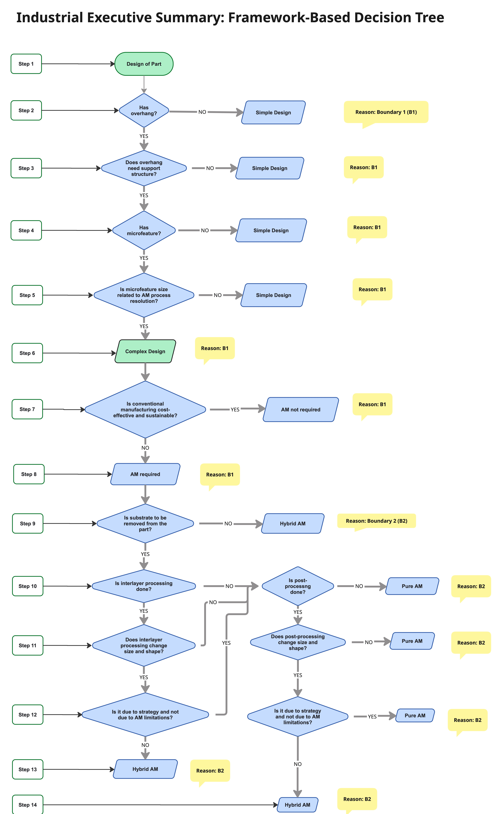

# Additive-Manufacturing-Decision-Tree

An industrial decision-tree framework designed to classify part designs and manufacturing strategies into distinct categories based on geometrical and processing boundaries.

> 📖 **Theoretical Foundation:** This classification framework is based on the concepts, arguments, and conclusions developed in the published book: **[Hybrid Additive Manufacturing Debate](https://doi.org/10.31224/7951)**.

## 📊 The Framework Flowchart

## 🔍 How it Works

The framework operates across two distinct classification boundaries derived from the book's dual-boundary system:

### 1. Boundary 1 (B1): Part Design Complexity
This section filters whether a part qualifies as a **Simple Design**, a **Complex Design**, or if **Additive Manufacturing (AM) is not required** based on:
* **Overhangs** and the necessity of support structures.
* **Microfeatures** and their relation to AM process resolution.
* **Sustainability and Cost-Effectiveness** compared to conventional manufacturing.

### 2. Boundary 2 (B2): Manufacturing Strategy (Pure vs. Hybrid AM)
Once AM is deemed necessary, this section classifies the production method into **Pure AM** or **Hybrid AM** based on:
* **Substrate removal** requirements.
* **Interlayer processing** and its effect on part size/shape.
* **Post-processing** impacts and whether these steps are driven by strategy or AM limitations.

## 🚀 Usage & Citation
Use this decision tree during the early stages of **Design for Additive Manufacturing (DfAM)** to evaluate production feasibility and optimize manufacturing workflows.

If you use this framework or flowchart in your research, please reference the original text:
* **Book:** *Hybrid Additive Manufacturing Debate* 
* **Link:** [Access the publication here](https://doi.org/10.31224/7951)
